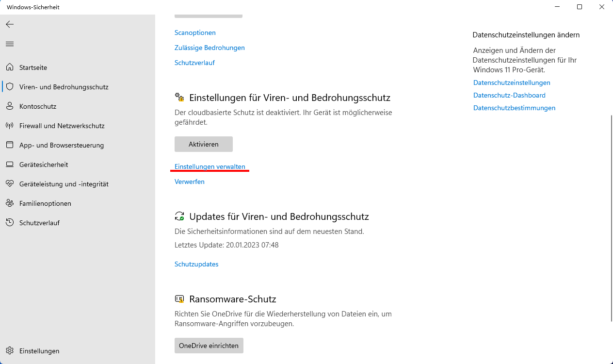
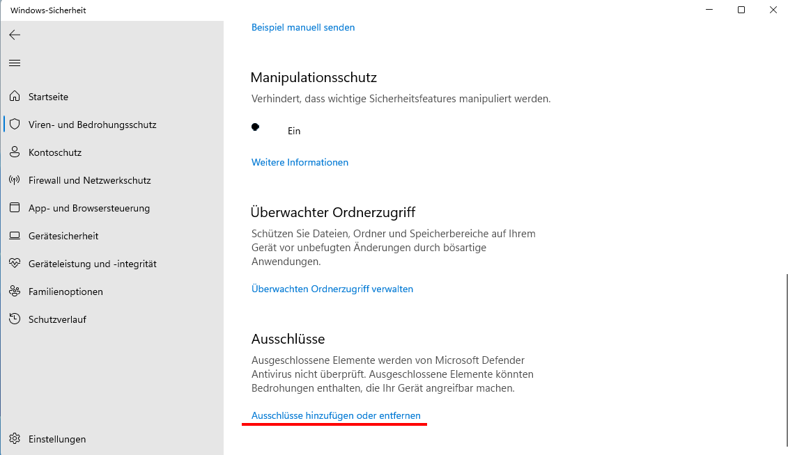
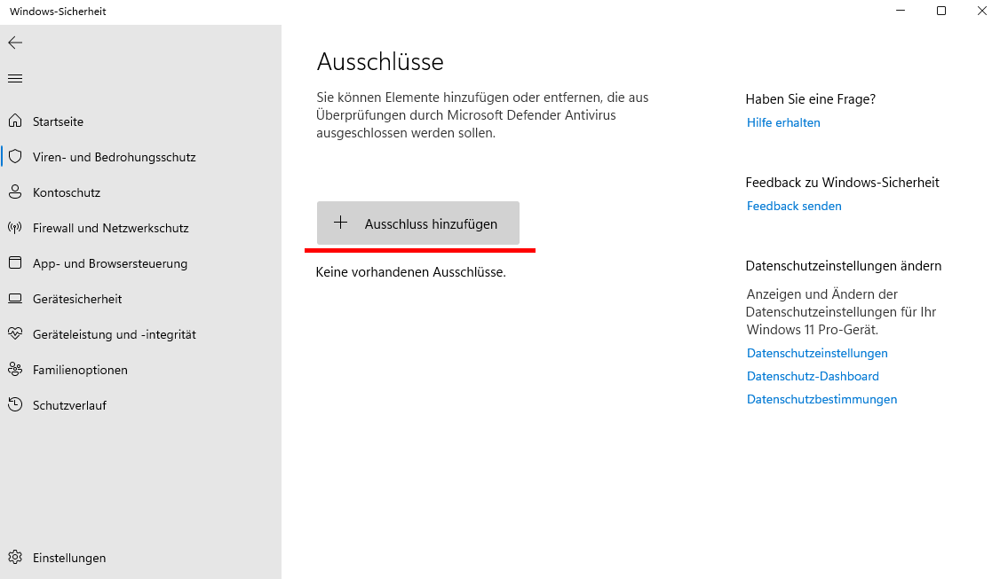
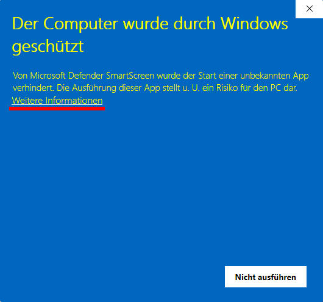
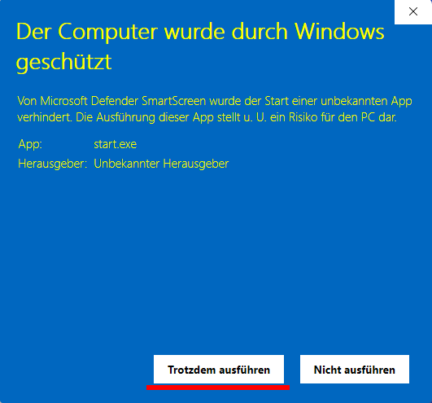

# 1. Einleitung

## 1.1 Terminologie

* PAdES: Der PDF Signaturstandard, der in der eIDAS Verordnung für signierte digitale Dokumente gefordert wird.
* PAdES Baselines: Der PAdES Standard besitzt unterschiedliche Baselines B, T, LT und LTA, die sich primär durch ein Vorhandensein der Zertifikatskette und eines externen vertrauenswürdigen Zeitstempels unterscheiden. Baseline B ist hierbei die einfachste Baseline (keine Zertifikatskette, kein vertrauenswürdiger Zeitstempel).

## 1.2 Systeme

- Einrichtungsoftware: Software die entsprechende PDFs erzeugt und diese Signieren soll
- Lokales Modul: Hilfsprogramm bzw. -dienst um PDFs datenschutzkonform signieren und validieren zu können
- Landesportal: Optionale Vertrauenswürdige Partei die entsprechende Einrichtungen für ein Bundesland autorisiert
- Signaturdienst: Zentraler Fernsignaturdienst, der für die Einrichtung signieren darf und die entsprechenden privaten Schlüssel besitzt
- Dritte: Dritte Parteien die eine digital signierte PDF validieren möchten

## 1.3 Anforderungen

### 1.3.1 Datenschutz
Der Inhalt von PDF Dokumenten sollte ein System nicht verlassen.

### 1.3.2 Sicherheit von privaten Schlüsseln
Private Schlüssel sollten ein System (bzw. sogar den sicheren Speicher eines Systems) nicht verlassen. Private Schlüssel sollten nicht in der Einrichtung gespeichert werden.

### 1.3.3 Zurückziehbarkeit von einzelnen Signaturen
Einzelne Signaturen sollten zurückgezogen bzw. invalidiert werden können, ohne die entsprechenden Signaturzertifikate im Gesamten zu invalidieren (und damit tausende von Signaturen zu invalidieren).

Dies ist in den Standards von digitalen Signaturen und Zertifikaten (zumindest bei PAdES) nicht vorgesehen und Bedarf proprietärer Validatoren.

## 1.4 Sequenzdiagramm


# 2. Aufsetzen des Lokalen Moduls

## 2.1 Download

Die jeweils neueste Version des Lokalen Moduls kann über die Releases des GitHub Repositorys heruntergeladen werden: https://github.com/bird-wp07/local-module/releases 

Es gibt hierbei zwei Versionen für Windows und Linux:
* Die Standard-Variante ist ein sehr kleiner Download, der die entsprechenden Abhängigkeiten wie den Digital Signature Service oder auch NodeJS herunterlädt. Der Release selbst ist daher sehr klein, der erste Start dauert jedoch aufgrund des Downloads eine Weile.
* Die Standalone-Variante ist ein großer Download, der aber schon alle Abhängigkeiten im Bauch hat. Der Download beim ersten Start des Programms entfällt daher.

## 2.2 Betrieb unter Windows

## 2.2.1 Ausführung mittels Powershell
### 2.2.1.1 Installation

Nachdem das Archiv vom GitHub Repository heruntergeladen wurde, das Archiv mit einem Archivprogramm (WinZip oder https://www.7-zip.org/) in ein beliebiges Verzeichnis entpacken. Das Lokale Modul besitzt keinen Installer und ist portabel.

#### 2.2.1.2 Einmalige Einrichtung des Betriebssystems

Um die Ausführung beliebiger Powershell Skripte zu erlauben, muss in einer Administrator Powershell (Windows-Taste drücken, "Powershell" eingeben, Rechtsklick auf den Powershell Eintrag und "Als Administrator ausführen" auswählen.

`Set-ExecutionPolicy unrestricted`

ausgeführt werden. Für weitere Informationen über die Freigabe der Ausführung von Powershell Skripten siehe https://learn.microsoft.com/en-us/powershell/module/microsoft.powershell.security/set-executionpolicy

Möglicherweise muss auch die Ausführung des Skripts manuell erlaubt werden. Hierfür muss in einer Powershell der Befehl

`Unblock-File -Path .\<BASIS_PFAD>\start.ps1`

abgesetzt werden, wobei <BASIS_PFAD> den Pfad zur 'start.ps1' Datei vom Arbeitsverzeichnis der Powershell darstellt. Abhängig von den Nutzerberechtigungen kann hierfür eine Administrator Powershell notwendig sein.

#### 2.2.1.3 Konfiguration

Die Ports des lokalen Moduls, sowie des im Hintergrund laufenden DSS Servers können über die beiligende Datei *CONFIG* konfiguriert werden, falls Kollisionen mit belegten Ports auftreten sollten.

#### 2.2.1.4 Start

Zum Starten des lokalen Moduls Rechtsklick auf 'start.ps1' und im Kontextmenü 'Mit PowerShell ausführen' wählen. Etwaige Meldungen des Windows Defender können ignoriert werden ("Abbrechen" klicken oder Fenster schließen). Eine Portfreigabe ist bei einem Zugriff vom selben Rechner aus nicht vonnöten.

#### 2.2.1.5 Beenden

Die Applikation kann durch wiederholte Eingabe der Tastenkombination Ctrl-C im Powershell Fenster unterbrochen werden. Hierbei werden auch alle Hintergrunddienste beendet.

### 2.2.2 Ausführung durch Doppelklick der start.exe

Das Windowsbundle des Lokalen Moduls liefert die gewöhnliche ausführbare Datei *start.exe* aus, welche alternativ zum Powershellskript verwendet werden kann. Das Vorgehen zur Konfiguration und Beendigung des Programms entspricht dem des Powershellskriptes. Meldungen des Windows Defender können auch hier ignoriert werden.

Leider markiert der Windows Antivirus (und möglicherweise auch andere Antivirussoftware) die Datei fälschlicherweise als Malware und verweigert ihre Ausführung. Daher kann es erforderlich sein, die *start.exe* nach dem Entpacken des Archivs in die entsprechende Whitelist aufzunehmen. Der Ablauf hierfür ist nachfolgend beispielhaft für Windows 11 dargestellt:

1. Entpacken des Archivs in ein beliebiges Verzeichnis
2. Im Reiter *Viren- und Bedrohungsschutz* des Menüs *Windows-Sicherheit* auf *Einstellungen verwalten* klicken.

    

3. *Ausschüsse hinzufügen oder entfernen* auswählen.

    

4. Anschließend auf *Ausschluss hinzufügen* klicken und über den Reiter *Datei* durch den Explorer die zuvor entpackte *start.exe* auswählen. Die freigegebene Datei wird anschließend unter den Ausschlüssen gelistet.

    

5. Doppelklick auf die *start.exe*. Trotz der Ausnahme erfordert Windows eine erneute Bestätigung. Hierfür im Warnfenster auf *Weitere Informationen* und anschließend auf *Trotzdem ausführen* klicken. Dies startet das Programm.

    

    
    
Dieser Vorgang muss nicht wiederholt werden. Zukünftig kann die Datei durch Doppelklick wie gewohnt gestartet werden.

## 2.3 Betrieb unter Linux

1. Downloaden des Linuxbundles. Die konkrete URL ist [dem aktuellsten Release](https://github.com/bird-wp07/local-module/releases) zu entnehmen.

   ```sh
   curl -Lo "local-module.tar.xz" "https://github.com/bird-wp07/local-module/releases/download/v0.0.44/wp07-local-module-linux-x64-standalone-v0.0.44.tar.xz"
   ```

2. Entpacken des tar.xz Archivs. Hierfür werden die entsprechenden Pakete für den Umgang mit dem XZ Kompressionsformat benötigt (z.B. *xz-utils* auf Debian-basierten Distributionen).

   ```sh
   tar -xvf "local-module.tar.xz"
   ```

3. Optional können zur Vermeidung von Portkollisionen in der Datei *start.sh* die Ports für das lokale Modul und den DSS Hintergrunddienst konfiguriert werden. Der relevante Abschnitt der Datei ist mit *ADMINISTRATOR SETTINGS* gekennzeichnet. Alternativ können die Ports über die Umgebungsvariablen *DSS_PORT* und *LOCAL_MODULE_PORT* gesetzt werden.

4. Starten des Lokalen Moduls durch Ausführen des Startupskripts. Hierbei werden alle benötigen Hintergrunddienste gestartet. Zum Betrieb werden neben den Linux Standardapplikationen `tar`, `curl`, `xz-utils`, `gzip` und `jq` benötigt. Bei einem Fehler während der Initialisierung aufgrund fehlender Programme empfehlen wir den gesamten Prozess in einem leeren Verzeichnis erneut durchzuführen.

   ```sh
   ./start.sh
   ```

5. Beenden des Lokalen Moduls durch saubere Terminierung des das Startupskript ausführenden Prozesses, z.B. durch die Tastenkombination Ctrl-C im entsprechenden Terminal, durch Schließen des Terminalfensters oder durch manuelles Senden des Signals `kill -SIGINT <PID>`. Hierbei werden alle gestarteten Hintergrunddienste beendet.

## 2.4 Sicherheit

Grundsätzlich ist das Lokale Modul als solches gedacht, das heißt es sollte vom selben Rechner aus zugegriffen werden. Der aufgespannte REST Service sollte dementsprechend so konfiguriert werden, dass nur der Rechner selbst (localhost bzw. 127.0.0.1) auf den Service Zugriff hat. Die Firewall des Systems sollte so konfiguriert sein, dass ein Zugriff auf die entsprechend konfigurierten Ports des Lokalen Moduls von außen nicht erlaubt ist. Dies sollte jedweden Angriffsvektor von außen auf ein Minimum reduzieren.

Andererseits speichert das Lokale Modul keine Daten und besitzt keinen nennenswerten Zugriff auf entsprechende lokale Ressourcen. Ein unautorisierter Zugriff von außerhalb auf das REST API des Lokalen Moduls sollte insofern zum jetzigen Zeitpunkt keine relevante Angriffsfläche bieten.


# 3. PDFs mit dem Lokalen Modul digital signieren

Das Lokale Modul dient als Hilfsprogramm bzw. lokaler Dienst für das digitale Signieren von PDFs, die mittels Fernsignatur von einem vertrauenswürdigem Service signiert werden sollen. Hierbei wird ein REST API vom Lokalen Modul aufgespannt, welches vom lokalen Rechner aus angesprochen werden kann. Eine Open API Spezifikation des REST Services kann bei einem erfolgten Start unter http://localhost:2048/swagger eingesehen werden (bitte den Port entsprechend auf die eigenen Werte abändern). 


## 3.1 Überblick

Um PDF Dokumente signieren zu können, sind folgende Schritte erforderlich. Meist werden diese einzelnen Schritte in Programmen zusammengefasst. Um die gewünschte datenschutzkonforme, und auf Fernsignaturen basierende, Architektur zu erreichen, müssen jedoch die Schritte einzeln von verschiedenen Systemen ausgeführt werden.

1. Zeitstempel der Signatur erzeugen -> Timestamp
2. Hash über das unsignierte PDF Dokument inkl. Timestamp bilden -> Hash
3. Hash mit entsprechendem privaten Schlüssel und dazugehöriger Zertifikatskette signieren -> Signatur
4. Die zur Verfügung gestellte Signatur mit dem unsignierten Dokument und dem Zeitstempel verschmelzen -> Signiertes Dokument


## 3.2 Zeitstempel der Signatur erzeugen

Der PAdES Standard benötigt entsprechende Zeitstempel einer PDF Signatur. Diese werden derzeit ohne vertrauenswürdigen Zeitstempeldienst erzeugt, daher unterstützt das Lokale Modul nur PAdES Baseline B und keine Langzeit Validierung von Dokumenten.

Da das Lokale Modul keine Daten persistiert, muss derselbe Zeitstempel beim Hash und auch beim Verschmelzen der PDF überreicht werden. Dies erfolgt durch einen [Unix-Zeitstempel](https://de.wikipedia.org/wiki/Unixzeit) in Millisekunden, das heißt die Anzahl von Millisekunden seit dem 01.01.1970 00:00:00 UTC, die über den entsprechenden Parameter beim Aufruf an das Lokale Modul gesendet werden müssen.


## 3.3 Digest / Hash von Dokumenten

Um eine PDF datenschutzkonform zu signieren, muss zuerst ein [Hash](https://de.wikipedia.org/wiki/Kryptographische_Hashfunktion) bzw. Digest der PDF gebildet werden. Das Bilden eines signierbaren Hashes einer PDF ist es jedoch leider nicht mit einem Hash aller Bytes des PDFs getan, da es sich beim PDF Format um ein Container-Format handelt und insofern nicht alle Bytes der PDF gehasht werden dürfen. Das Lokale Modul kümmert sich hier um das Erstellen des korrekten Hashes vom PDF Container Format.

Ebenso beschreibt der PAdES Standard das Einbinden eines lokalen Zeitstempels in den Hash hinein, daher muss zum Zeitpunkt des Hashens schon der entsprechene Signierzeitpunkt als Zeitstempel dem Lokalen Modul mitgegeben werden.


HTTP Aufruf: POST /digest/pdf

Header:
```
Accept: application/json
```


Request Body:
```
{
    "digestAlgorithm": "SHA256",
    "bytes": "<Base64 Repräsentation der unsignierten PDF Bytes>",
    "signingTimestamp": 1672531200000
}
```

* digestAlgorithm: Der verwendete Hash Algorithmus. Hier wird vorerst SHA256 empfohlen.
* bytes: Die Base64 Repräsentation aller Bytes der unsignierten PDF
* signingTimestamp: Der [Unix-Zeitstempel](https://de.wikipedia.org/wiki/Unixzeit) in Millisekunden, das heißt die Anzahl von Millisekunden seit dem 01.01.1970 00:00:00 UTC. Dieser Zeitstempel muss später mit dem Zeitstempel des Verschmelzen Aufrufs übereinstimmen.

Sofern das Lokale Modul einen Hash bestimmten konnte, wird dieser als Base64 Repräsentation zurückgegeben:

Response Body:
```
{
    "bytes": "<Base64 Repräsentation des Hashes der unsignierten PDF>",
}
```

## 3.4 Hash Signieren

Der vom Lokalen Modul erzeugte Hash kann nun von einem Fernsignaturdienst signiert werden. Hierbei sollte ein vertrauenswürdiges Zertifikat zum Signieren benutzt werden, damit die Vertrauenskette beim Öffnen des signierten PDFs entsprechend gefunden und validiert werden kann.

Das Lokale Modul kann diesen Teil nicht übernehmen, da entsprechende private Schlüssel von vertrauenswürdigen Zertifikaten vonnöten sind. Die Architektur basiert hier auf einer Fernsignatur, die eine sichere Schlüsselverwaltung eines vertrauenswürdigen Anbieters bevorzugt.

Der Aufruf des Signierens ist anbieterspezifisch und muss ebenfalls authentifiziert und autorisiert werden. Der Rückgabewert des Signaturaufrufs ist meist eine sogenannte CMS (Cryptographic Message Syntax), die in unserem Fall per String im Base64 Format übergeben wird. Innerhalb der CMS befindet sich die digitale Signatur selbst, das benutzte Signaturzertifikat und auch die entsprechende Zertifikatskette.

## 3.5 Dokument und digitale Signatur verschmelzen

Das Verschmelzen der unsignierten PDF mit der digitalen Signatur wird nun wieder vom Lokalen Modul übernommen. Hierbei wird wieder das unsignierte PDF im Base64 Format, derselbe Zeitstempel und die CMS an das Lokale Modul übergeben.

HTTP Aufruf: POST /merge/pdf

Header:
```
Accept: application/json
```


Request Body:
```
{
    "bytes": "<Base64 Repräsentation der unsignierten PDF Bytes>",
    "signatureAsCMS": "<Base64 Repräsentation der vom Sigierservice empfangenen CMS>",
    "signingTimestamp": 1672531200000
}
```

* bytes: Die Base64 Repräsentation aller Bytes der unsignierten PDF
* signatureAsCMS: Die Base64 Repräsentation der vom Sigierservice empfangenen CMS
* signingTimestamp: Der [Unix-Zeitstempel](https://de.wikipedia.org/wiki/Unixzeit) in Millisekunden, das heißt die Anzahl von Millisekunden seit dem 01.01.1970 00:00:00 UTC. Dieser Zeitstempel muss mit dem Zeitstempel des vorherigen Hash Aufrufs der PDF übereinstimmen.

Sofern das Lokale Modul das unsignierte PDF mit dem Zeitstempel und der digitalen Signatur verschmelzen konnte, wird das signierte PDF als Base64 Repräsentation zurückgegeben.

Response Body:
```
{
    "bytes": "<Base64 Repräsentation der signierten PDF>",
}
```

# 4. Work-in-Progress: Digital signierte PDFs mit dem Lokalen Modul validieren

Um die Validität einer digital signierten PDF zu überprüfen, sollte ebenfalls das Lokale Modul benutzt werden. Hierbei werden verschiedenste Merkmale der PDF und dessen Signatur überprüft, äquivalent zu den meisten PDF Anzeigeprogrammen bzw. dem PAdES Standard:

Kryptografisch:
- Die Integrität des Dokumentes: Wurde das Dokument nach der digitalen Signatur ggf. verändert?
- Die Integrität der digitalen Signatur: Stimmt die digitale Signatur mit dem entsprechenden öffentlichen Signierzertifikat (öffentlicher Schlüssel des Signierers) überin?
- Die Integrität der Zertifikatskette: Stimmen die digitalen Signaturen der gesamten Vertrauenskette mit den jeweiligen Ausstellerzertifikaten überein?

Zeitlich:
- Ist das Dokument innerhalb der Gültigkeit des Signierzertifikats unterschrieben worden?
- Sind alle Zertifikate der Zertifikatskette noch gültig ODER besitzt das Dokument einen Vertrauenswürdigen Zeitstempel, der besagt, dass alle Zertifikate zum Zeitpunkt des Signierens gültig waren?

Organisatorisch:
- Die Vertrauensstellung zur Zertifikatskette: Gibt es eine Vertrauensanker zum Herausgeber bzw. den Herausgebern der Zertifikatskette?


Zusätzlich zum PAdES Standard werden weitere Merkmale des Dokumentes überprüft. Hierbei handelt es sich um einen proprietären Zusatz, der folgende Sachverhalte ermöglichen kann:

- Zurückziehen von einzelnen Signaturen (und nicht nur der Zertifikate)
- Validierung von Autorisierungen einer Einrichtung bzgl. des vorliegenden Dokumententyps (z.B. darf eine Schule kein Master-Zeugnis ausstellen)
- Abgleich von Daten des PDFs zu den Daten die sich ggf. innerhalb einer Struktur innerhalb des PDFs befinden (z.B. Name des PDFs gleicht dem Namen des XSchule Formats innerhalb der PDF)

HTTP Aufruf: POST /validate/pdf

Header:
```
Accept: application/json
```


Request Body:
```
{
    "bytes": "<Base64 Repräsentation der signierten PDF Bytes>",
}
```

* bytes: Die Base64 Repräsentation aller Bytes der signierten PDF

Sofern das Lokale Modul das signierte PDF einlesen konnte, wird das signierte PDF überprüft und ein entsprechender Validierungswert zurückgeliefert.

Response Body:
```
{
    "result": "TOTAL_FAILED" | "FAILED" | "INDETERMINATE" | "PASSED" | "TOTAL_PASSED",
    "reason": "NO_SIGNATURE_FOUND" | "FORMAT_FAILURE" | "HASH_FAILURE" | "SIG_CRYPTO_FAILURE" | "REVOKED" | "EXPIRED" | "NOT_YET_VALID" | "SIG_CONSTRAINTS_FAILURE" | "CHAIN_CONSTRAINTS_FAILURE" | "CERTIFICATE_CHAIN_GENERAL_FAILURE" | "CRYPTO_CONSTRAINTS_FAILURE" | "POLICY_PROCESSING_ERROR" | "SIGNATURE_POLICY_NOT_AVAILABLE" | "TIMESTAMP_ORDER_FAILURE" | "NO_SIGNING_CERTIFICATE_FOUND" | "NO_CERTIFICATE_CHAIN_FOUND" | "REVOKED_NO_POE" | "REVOKED_CA_NO_POE" | "OUT_OF_BOUNDS_NOT_REVOKED" | "OUT_OF_BOUNDS_NO_POE" | "REVOCATION_OUT_OF_BOUNDS_NO_POE" | "CRYPTO_CONSTRAINTS_FAILURE_NO_POE" | "NO_POE" | "TRY_LATER" | "SIGNED_DATA_NOT_FOUND"
}
```