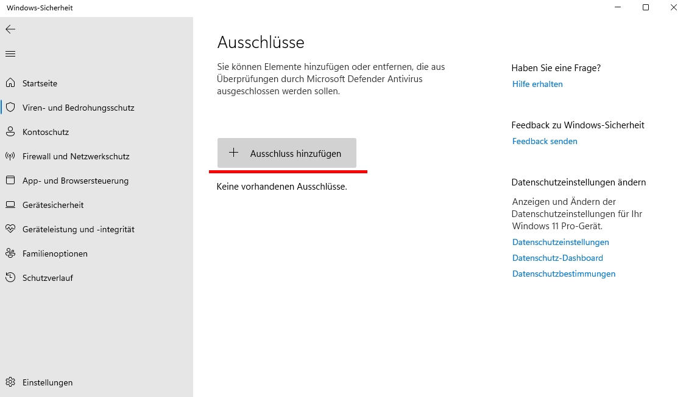
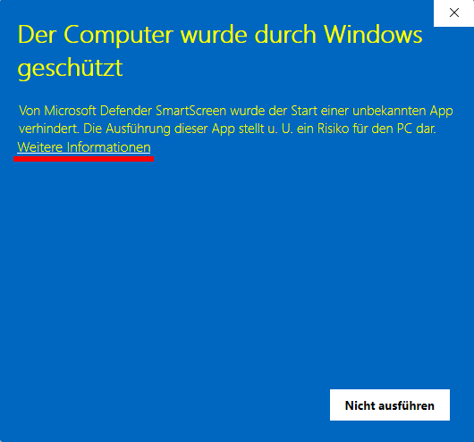
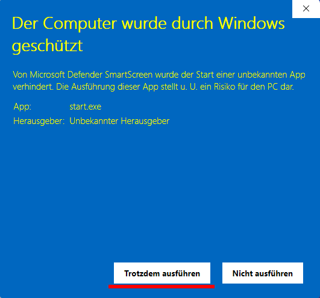

# Testhinweise für einen nicht-produktiven Betrieb

## Windows-Defender Warnhinweis für start.exe ausschalten

Leider markiert der Windows Defender (und möglicherweise auch Antivirussoftware) die geruntergeladene Datei als nicht-vertrauenswürdig. Daher kann es erforderlich sein, die *start.exe* nach dem Entpacken des Archivs in die entsprechende Allowlist aufzunehmen. Der Ablauf hierfür ist nachfolgend beispielhaft für Windows 11 dargestellt:

1. Entpacken des Archivs in ein beliebiges Verzeichnis
2. Im Reiter *Viren- und Bedrohungsschutz* des Menüs *Windows-Sicherheit* auf *Einstellungen verwalten* klicken.

    

3. *Ausschüsse hinzufügen oder entfernen* auswählen.

    

4. Anschließend auf *Ausschluss hinzufügen* klicken und über den Reiter *Datei* durch den Explorer die zuvor entpackte *start.exe* auswählen. Die freigegebene Datei wird anschließend unter den Ausschlüssen gelistet.

    

5. Doppelklick auf die *start.exe*. Trotz der Ausnahme erfordert Windows eine erneute Bestätigung. Hierfür im Warnfenster auf *Weitere Informationen* und anschließend auf *Trotzdem ausführen* klicken. Dies startet das Programm.

    

    
    
Dieser Vorgang muss nicht wiederholt werden. Zukünftig kann die Datei durch Doppelklick wie gewohnt gestartet werden.