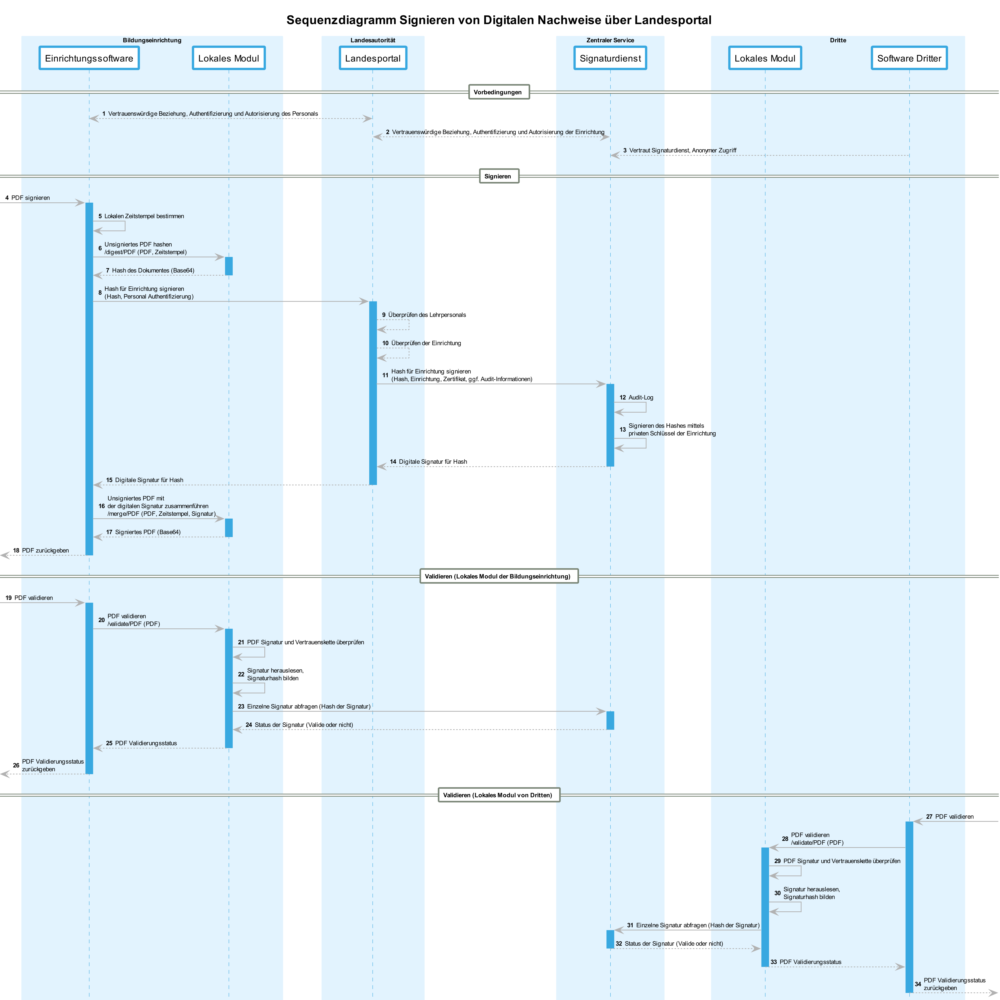

# 1. Einleitung

## 1.1 Terminologie

* PAdES: Der PDF Signaturstandard, der in der eIDAS Verordnung für signierte digitale Dokumente gefordert wird.
* PAdES Baselines: Der PAdES Standard besitzt unterschiedliche Baselines B, T, LT und LTA, die sich primär durch ein Vorhandensein der Zertifikatskette und eines externen vertrauenswürdigen Zeitstempels unterscheiden. Baseline B ist hierbei die einfachste Baseline (keine Zertifikatskette, kein vertrauenswürdiger Zeitstempel).

## 1.2 Systeme

- Einrichtungsoftware: Software die entsprechende PDFs erzeugt und diese Signieren soll
- Lokales Modul: Hilfsprogramm bzw. -dienst um PDFs datenschutzkonform signieren und validieren zu können
- Landesportal: Optionale Vertrauenswürdige Partei die entsprechende Einrichtungen für ein Bundesland autorisiert
- Signaturdienst: Zentraler Fernsignaturdienst, der für die Einrichtung signieren darf und die entsprechenden privaten Schlüssel besitzt
- Dritte: Dritte Parteien die eine digital signierte PDF validieren möchten

## 1.3 Anforderungen

### 1.3.1 Datenschutz
Der Inhalt von PDF Dokumenten sollte ein System nicht verlassen.

### 1.3.2 Sicherheit von privaten Schlüsseln
Private Schlüssel sollten ein System (bzw. sogar den sicheren Speicher eines Systems) nicht verlassen. Private Schlüssel sollten nicht in der Einrichtung gespeichert werden.

### 1.3.3 Zurückziehbarkeit von einzelnen Signaturen
Einzelne Signaturen sollten zurückgezogen bzw. invalidiert werden können, ohne die entsprechenden Signaturzertifikate im Gesamten zu invalidieren (und damit tausende von Signaturen zu invalidieren).

Dies ist in den Standards von digitalen Signaturen und Zertifikaten (zumindest bei PAdES) nicht vorgesehen und Bedarf proprietärer Validatoren.

## 1.4 Sequenzdiagramm




# 2. Aufsetzen des Lokalen Moduls

## 2.1 Download

Die jeweils neueste Version des Lokalen Moduls kann über die Releases des GitHub Repositorys heruntergeladen werden: https://github.com/bird-wp07/local-module/releases. Es stehen Versionen für Linux sowie Windows Systeme in x64 Architektur zur Verfügung.

## 2.2 Betrieb unter Windows

## 2.2.1 Ausführung mittels Powershell
### 2.2.1.1 Installation

Nachdem das Archiv vom GitHub Repository heruntergeladen wurde, das Archiv mit einem Archivprogramm (WinZip oder https://www.7-zip.org/) in ein beliebiges Verzeichnis entpacken. Das Lokale Modul besitzt keinen Installer und ist portabel.

#### 2.2.1.2 Konfiguration

Die beiliegende Datei *CONFIG* dient der Konfiguration des Lokalen Moduls. Folgende Parameter, welche teilweise bereits mit sinnvollen Standardwerten versehen sind, müssen hier definiert werden:

- `LOCAL_MODULE_BASEURL`: Die Basis-URL des Lokalen Moduls in ausführlicher `SCHEMA://HOST:PORT` Schreibweise. Statt *localhost* muss explizit die Loopbackadresse *127.0.0.1* angegeben werden.
    - Beispiel: `http://127.0.0.1:2048`
- `LOCAL_MODULE_LOGDIR`: Pfad des Ausgabeverzeichnisses für die vom Lokalen Modul zusätzlich zum Stdout generierten Logs (optional). Der Pfad wird relativ zur *start.exe* aufgelöst. Alternativ kann ein absoluter Pfad verwendet werden. Bei leerem Parameterwert werden keine Logdateien erzeugt. Logeinträge werden als einzeilige, '\n'-separierte JSON Objekte mit den Feldern *level*, *message* und *timestamp* (ISO 8601) ausgegeben.
- `DSS_BASEURL`: Die Basis-URL des DSS Hintergrunddienstes in ausführlicher `SCHEMA://HOST:PORT` Schreibweise, wobei das Schema bzw. der Host auf *http* bzw. *127.0.0.1* festgelegt sind und nicht geändert werden können. Der Port kann frei gewählt werden.
    - Beispiel: `http://127.0.0.1:8089`
- `CS_BASEURL`: Die Basis-URL des API des Zentralen Dienstes.
- `CS_TOKEN_URL`: Die URL des Open-ID Connect Endpunkts des Zentralen Dienstes zur Ausstellung von JWTs.
- `CS_CA_PEM`: PEM-Datei mit Serverzertifikat für mTLS Verbindung zum Zentralen Dienst. Diese Datei muss sich im selben Verzeichnis wie die aus dem Archiv entpackten Dateien befinden. Alternativ kann ein beliebiger absoluter Pfad angegeben werden.

    Diese Datei wird nicht mit dem Bundle ausgeliefert.
- `CS_CLIENT_PFX`: PKCS#12-Datei mit Clientzertifikat und privatem Schlüssel für die mTLS Verbindung zum Zentralen Dienst. Diese Datei muss sich im selben Verzeichnis wie die aus dem Archiv entpackten Dateien befinden. Alternativ kann ein beliebiger absoluter Pfad angegeben werden.

    Diese Datei wird nicht mit dem Bundle ausgeliefert.
- `CS_CLIENT_PFX_PASSWORD`: Passwort zum Entschlüsseln des privaten Clientschlüssels im Klartext.

    Das Password wird nicht mit dem Bundle ausgeliefert.

Alternativ können all genannten Werte über Umgebungsvariablen konfiguriert werden, deren Namen sich nur durch ein `WP07_` Präfix gegenüber ihren jeweiligen Konfigurationsparameter unterscheiden (z.B. wird der Wert des `DSS_BASEURL` Parameters aus der `WP07_DSS_BASEURL` Umgebungsvariablen übernommen, sofern diese existiert).

#### 2.2.1.3 Start

Zum Starten des lokalen Moduls Rechtsklick auf 'start.ps1' und im Kontextmenü 'Mit PowerShell ausführen' wählen. Etwaige Meldungen des Windows Defender können ignoriert werden ("Abbrechen" klicken oder Fenster schließen). Eine Portfreigabe ist bei einem Zugriff vom selben Rechner aus nicht vonnöten.

#### 2.2.1.4 Beenden

Die Applikation kann durch wiederholte Eingabe der Tastenkombination Ctrl-C im Powershell Fenster unterbrochen werden. Hierbei werden auch alle Hintergrunddienste beendet.

### 2.2.2 Ausführung der start.exe

Das Windowsbundle des Lokalen Moduls liefert die gewöhnliche ausführbare Datei *start.exe* aus, welche alternativ zum Powershellskript verwendet werden kann. Das Vorgehen zur Konfiguration und Beendigung des Programms entspricht dem des Powershellskriptes.

Derzeit gibt es noch keine signierte Version der start.exe, daher werden ggf. Warnmeldungen des Windows Defenders angezeigt. Eine Anleitung wie diese für einen Testbetrieb ausgeschaltet werden können, findet sich unter den [windowsspezifischen Hinweisen](https://github.com/bird-wp07/local-module/blob/main/docs/windows.md)

## 2.3 Betrieb unter Linux

1. Downloaden des Linuxbundles. Die konkrete URL ist [dem aktuellsten Release](https://github.com/bird-wp07/local-module/releases) zu entnehmen.

   ```sh
   curl -Lo "local-module.tar.xz" "https://github.com/bird-wp07/local-module/releases/download/v0.0.44/wp07-local-module-linux-x64-standalone-v0.0.44.tar.xz"
   ```

2. Entpacken des tar.xz Archivs. Hierfür werden die entsprechenden Pakete für den Umgang mit dem XZ Kompressionsformat benötigt (z.B. *xz-utils* auf Debian-basierten Distributionen).

   ```sh
   tar -xvf "local-module.tar.xz"
   ```

3. Die Konfiguration des Lokalen Moduls wird auf Linuxsystemen über die Kopfzeilen der *start.sh* Datei durchgeführt. Im Abschnitt *ADMINISTRATOR SETTINGS* befinden sich Schlüssel-Wert Paare in Form gewöhnlicher Variablendeklarationen welche der Konfiguration dienen.

    Eine detaillierte Auflistung und Erklärung der Konfigurationsparameter ist im entsprechenden Windowsabschnitt vorzufinden. Die Konfiguration unterscheidet sich zwischen den Betriebssystemen nicht.

4. Starten des Lokalen Moduls durch Ausführen des Startupskripts. Hierbei werden alle benötigen Hintergrunddienste gestartet. Zum Betrieb werden neben den Linux Standardapplikationen `tar`, `curl`, `xz-utils`, `gzip` und `jq` benötigt. Bei einem Fehler während der Initialisierung aufgrund fehlender Programme empfehlen wir den gesamten Prozess in einem leeren Verzeichnis erneut durchzuführen.

   ```sh
   ./start.sh
   ```

5. Beenden des Lokalen Moduls durch saubere Terminierung des das Startupskript ausführenden Prozesses, z.B. durch die Tastenkombination Ctrl-C im entsprechenden Terminal, durch Schließen des Terminalfensters oder durch manuelles Senden des Signals `kill -SIGINT <PID>`. Hierbei werden alle gestarteten Hintergrunddienste beendet.

## 2.4 Sicherheit

Grundsätzlich ist das Lokale Modul als solches gedacht, das heißt es sollte vom selben Rechner aus zugegriffen werden. Der aufgespannte REST Service sollte dementsprechend so konfiguriert werden, dass nur der Rechner selbst (localhost bzw. 127.0.0.1) auf den Service Zugriff hat. Die Firewall des Systems sollte so konfiguriert sein, dass ein Zugriff auf die entsprechend konfigurierten Ports des Lokalen Moduls von außen nicht erlaubt ist. Dies sollte jedweden Angriffsvektor von außen auf ein Minimum reduzieren.

Das Lokale Modul speichert derzeit keine Daten und besitzt keinen nennenswerten Zugriff auf entsprechende lokale Ressourcen. Ein unautorisierter Zugriff von außerhalb auf das REST API des Lokalen Moduls sollte insofern zum jetzigen Zeitpunkt keine relevante Angriffsfläche für den Rechner, auf dem das Lokale Modul läuft, bilden.

Sofern jedoch das Lokale Modul mit entsprechenden Zertifikaten und Authentifizierungsmerkmalen für einen Fernsignaturdienst, z.B. dem zentralen Service, ausgestattet ist, müssen weitere Sicherheitsvorkehrungen in Betracht gezogen werden. 


# 3. PDFs mit dem Lokalen Modul digital signieren

Das Lokale Modul dient als Hilfsprogramm bzw. lokaler Dienst für das digitale Signieren von PDFs, die mittels Fernsignatur von einem vertrauenswürdigem Service signiert werden sollen. Hierbei wird ein REST API vom Lokalen Modul aufgespannt, welches vom lokalen Rechner aus angesprochen werden kann. Eine Open API Spezifikation des REST Services kann bei einem erfolgten Start unter http://localhost:2048/swagger eingesehen werden (bitte den Port entsprechend auf die eigenen Werte abändern). 


## 3.1 Überblick

Um PDF Dokumente signieren zu können, sind folgende Schritte erforderlich. Meist werden diese einzelnen Schritte in Programmen zusammengefasst. Um die gewünschte datenschutzkonforme, und auf Fernsignaturen basierende, Architektur zu erreichen, müssen jedoch die Schritte einzeln von verschiedenen Systemen ausgeführt werden.

1. Zeitstempel der Signatur erzeugen -> Timestamp
2. Hash über das unsignierte PDF Dokument inkl. Timestamp bilden -> Hash
3. Hash mit entsprechendem privaten Schlüssel und dazugehöriger Zertifikatskette signieren -> Signatur
4. Die zur Verfügung gestellte Signatur mit dem unsignierten Dokument und dem Zeitstempel verschmelzen -> Signiertes Dokument

Die entsprechenden REST APIs können über eine Swagger UI angesprochen, das vom Lokalen Modul aufgespannt wird. Dafür kann einfach die URL `/swagger` aufgerufen werden.

Es existiert ebenfalls eine OpenAPI Spezifikation des REST APIs in der Datei `openapi.json`. Diese ist direkt im Release Bundle des Lokalen Moduls verfügbar. Es existiert ebenfalls eine [OpenAPI Spezifikation](./../src/server/openapi.json) im Github Repository.


## 3.2 Zeitstempel der Signatur erzeugen

Der PAdES Standard benötigt entsprechende Zeitstempel einer PDF Signatur. Diese werden derzeit ohne vertrauenswürdigen Zeitstempeldienst erzeugt, daher unterstützt das Lokale Modul nur PAdES Baseline B und keine Langzeit Validierung von Dokumenten.

Da das Lokale Modul keine Daten persistiert, muss derselbe Zeitstempel beim Hash und auch beim Verschmelzen der PDF überreicht werden. Dies erfolgt durch einen [Unix-Zeitstempel](https://de.wikipedia.org/wiki/Unixzeit) in Millisekunden, das heißt die Anzahl von Millisekunden seit dem 01.01.1970 00:00:00 UTC, die über den entsprechenden Parameter beim Aufruf an das Lokale Modul gesendet werden müssen.


## 3.3 Digest / Hash von Dokumenten

Um eine PDF datenschutzkonform zu signieren, muss zuerst ein [Hash](https://de.wikipedia.org/wiki/Kryptographische_Hashfunktion) bzw. Digest der PDF gebildet werden. Das Bilden eines signierbaren Hashes einer PDF ist es jedoch leider nicht mit einem Hash aller Bytes des PDFs getan, da es sich beim PDF Format um ein Container-Format handelt und insofern nicht alle Bytes der PDF gehasht werden dürfen. Das Lokale Modul kümmert sich hier um das Erstellen des korrekten Hashes vom PDF Container Format.

Ebenso beschreibt der PAdES Standard das Einbinden eines lokalen Zeitstempels in den Hash hinein, daher muss zum Zeitpunkt des Hashens schon der entsprechene Signierzeitpunkt als Zeitstempel dem Lokalen Modul mitgegeben werden.


HTTP Aufruf: POST /digest/pdf

Header:
```
Accept: application/json
```


Request Body:
```
{
    "bytes": "<Base64 Repräsentation der unsignierten PDF Bytes>",
    "signingTimestamp": 1672531200000
}
```

* `bytes`: Die Base64 Repräsentation aller Bytes der unsignierten PDF
* `signingTimestamp`: Der [Unix-Zeitstempel](https://de.wikipedia.org/wiki/Unixzeit) in Millisekunden, das heißt die Anzahl von Millisekunden seit dem 01.01.1970 00:00:00 UTC. Dieser Zeitstempel muss später mit dem Zeitstempel des Verschmelzen Aufrufs übereinstimmen.

Sofern das Lokale Modul einen Hash bestimmten konnte, wird dieser als Base64 Repräsentation zurückgegeben:

Response Body:
```
{
    "bytes": "<Base64 Repräsentation des Hashes der unsignierten PDF>",
}
```

## 3.4 Signatur über den Hash ausstellen lassen

Der vom Lokalen Modul erzeugte Hash kann nun von einem Fernsignaturdienst signiert werden. Hierbei sollte ein vertrauenswürdiges Zertifikat zum Signieren benutzt werden, damit die Vertrauenskette beim Öffnen des signierten PDFs entsprechend gefunden und validiert werden kann.

Der Rückgabewert des Signaturaufrufs ist meist eine sogenannte CMS (Cryptographic Message Syntax), die in unserem Fall per String im Base64 Format übergeben wird. Innerhalb der CMS befindet sich die digitale Signatur selbst, das benutzte Signaturzertifikat und auch die entsprechende Zertifikatskette.

Das Lokale Modul kann diesen Teil über den zentralen Service insoweit übernehmen, falls entsprechende mutual-TLS Zertifikate zum zentralen Service verfügbar sind und die Organisation diesbzgl. authentifiziert und autorisiert wurde.

Es kann aber ebenfalls ein vertrauenswürdiger Intermediär, z.B. ein landesweites Bildungsportal, diesen Schritt übernehmen und für die Organisationen das Dokument ausstellen lassen.

HTTP Aufruf: POST /issue

Header:
```
Accept: application/json
```


Request Body:
```
{
    "bytes": "<Base64 Repräsentation des Hashes>",
    "issuerId": "<UUIDv4 des entsprechenden Issuers auf dem zentralen Service>",
    "auditLog?": "<Ein optionaler Audit-Eintrag für den zentralen Service>"
}
```

* `bytes`: Die Base64 Repräsentation des Hashes, also z.B. der Response Wert vom /digest/pdf Aufruf
* `issuerId`: Die ID des zu benutzenden Signierzertifikats der Bildungseinrichtung
* `auditLog?`: Ein optionaler Audit-Eintrag für den zentralen Service. Dieser Eintrag kann benutzt werden um ggf. Missbrauch von Signaturen aufzudecken. Hierbei sollte es um einen anonymen oder pseudonymen Wert handeln, der auf der Seite des Lokalen Moduls ggf. zu entsprechenden Nutzern oder Rollen aufgeschlüsselt werden kann.

Sofern das Lokale Modul den Hash über den zentralen Service ausstellen konnte, wird die Signatur als CMS-Format (Cryptographic Message Syntax) zurückgegeben.

Response Body:
```
{
    "cms": "<Base64 Repräsentation der ausgestellten Signatur im CMS Format>",
}
```


## 3.5 Dokument und digitale Signatur verschmelzen

Das Verschmelzen der unsignierten PDF mit der digitalen Signatur wird nun wieder vom Lokalen Modul übernommen. Hierbei wird das unsignierte PDF im Base64 Format, derselbe Zeitstempel und die CMS an das Lokale Modul übergeben.

HTTP Aufruf: POST /merge/pdf

Header:
```
Accept: application/json
```


Request Body:
```
{
    "bytes": "<Base64 Repräsentation der unsignierten PDF Bytes>",
    "cms": "<Base64 Repräsentation der vom Signierservice empfangenen CMS>",
    "signingTimestamp": 1672531200000
}
```

* `bytes`: Die Base64 Repräsentation aller Bytes der unsignierten PDF
* `cms`: Die Base64 Repräsentation der vom Signierservice empfangenen CMS
* `signingTimestamp`: Der [Unix-Zeitstempel](https://de.wikipedia.org/wiki/Unixzeit) in Millisekunden, das heißt die Anzahl von Millisekunden seit dem 01.01.1970 00:00:00 UTC. Dieser Zeitstempel muss mit dem Zeitstempel des vorherigen Hash Aufrufs der PDF übereinstimmen.

Sofern das Lokale Modul das unsignierte PDF mit dem Zeitstempel und der digitalen Signatur verschmelzen konnte, wird das signierte PDF als Base64 Repräsentation zurückgegeben.

Response Body:
```
{
    "bytes": "<Base64 Repräsentation der signierten PDF>",
}
```

# 4. Digital signierte PDFs mit dem Lokalen Modul validieren

Um die Validität einer digital signierten PDF zu überprüfen, sollte ebenfalls das Lokale Modul benutzt werden. Hierbei werden verschiedenste Merkmale der PDF und dessen Signatur überprüft, äquivalent zu den meisten PDF Anzeigeprogrammen bzw. dem PAdES Standard, der auch für die eIDAS Verordnung benutzt werden muss:

Kryptografisch:
- Die Integrität des Dokumentes: Wurde das Dokument nach der digitalen Signatur ggf. verändert?
- Die Integrität der digitalen Signatur: Stimmt die digitale Signatur mit dem entsprechenden öffentlichen Signierzertifikat (öffentlicher Schlüssel des Signierers) überein?
- Die Integrität der Zertifikatskette: Stimmen die digitalen Signaturen der gesamten Vertrauenskette mit den jeweiligen Ausstellerzertifikaten überein?

Zeitlich:
- Ist das Dokument innerhalb der Gültigkeit des Signierzertifikats unterschrieben worden?
- Sind alle Zertifikate der Zertifikatskette noch gültig ODER besitzt das Dokument einen vertrauenswürdigen Zeitstempel, der besagt, dass alle Zertifikate zum Zeitpunkt des Signierens gültig waren? (Long-Term Validation von PDF Dokumenten, damit auch nachdem digitale Zertifikate abgelaufen sind, ein Dokument seine Gültigkeit nicht verliert)

Organisatorisch:
- Wurde ein Zertifikat der Zertifikatskette zurückgezogen?
- Die Vertrauensstellung zur Zertifikatskette: Gibt es eine Vertrauensanker zum Herausgeber bzw. den Herausgebern der Zertifikatskette?


Zusätzlich zum PAdES Standard werden weitere Merkmale des Dokumentes überprüft. Hierbei handelt es sich um einen proprietären Zusatz, der folgende Sachverhalte ermöglicht:

- Zurückziehen von einzelnen Signaturen (und nicht nur der Zertifikate)
- Mögliche Validierung von Autorisierungen einer Einrichtung bzgl. des vorliegenden Dokumententyps (z.B. darf eine Schule kein Master-Zeugnis ausstellen)
- Möglicher Abgleich von Daten des PDFs zu den Daten die sich ggf. innerhalb einer Struktur innerhalb des PDFs befinden (z.B. Name des PDFs gleicht dem Namen des XSchule Formats innerhalb der PDF)

HTTP Aufruf: POST /validate/pdf

Header:
```
Accept: application/json
```


Request Body:
```
{
    "bytes": "<Base64 Repräsentation des signierten PDFs>",
}
```

* `bytes`: Die Base64 Repräsentation des signierten PDFs

Sofern das Lokale Modul das signierte PDF einlesen konnte, wird das signierte PDF überprüft und ein entsprechender Validierungswert zurückgeliefert. Der Validierungswert des Lokalen Moduls ist tatsächlich binär, das heißt das Lokale Modul interpretiert das entsprechend eingelesene PDF nach vordefinierten Regeln und gibt die Validität in WAHR oder FALSCH zurück. Eine entsprechende detaillierte Unterscheidung kann in den jeweiligen Properties `document` und `issuance` eingesehen werden.

Response Body:
```
{
    "valid": true | false,
    "document": {
        "status": "DOCUMENT_OK" | "ERROR_DOCUMENT_UNTRUSTED" | "ERROR_DOCUMENT_INVALID",
        "details?": any
    },
    "issuance": {
        "status": "ISSUANCE_OK" | "ERROR_ISSUANCE_NOT_FOUND" | "ERROR_ISSUANCE_REVOKED" | "ERROR_ISSUER_REVOKED" | "ERROR_DOCUMENT_INVALID",
        "details?": any
    },
    "documentSignatureDigest": "<Base64 Repräsentation des Hashes des Signaturwertes>"
}
```

* `valid`: Ein Boolean-Wert über den Status des Dokumentes, der primär benutzt werden sollte. Das Dokument ist entweder valide oder nicht, es gibt hier keine Grauzone.
* `document`: Information über das Dokument selbst
  * `status`: Die Validität des Dokuments an sich. Hierbei wird die entsprechende Signatur des Dokumentes kryptografisch überprüft und auch das eIDAS Vertrauenslevel spielt eine Rolle
    * `DOCUMENT_OK`: Das Dokument an sich ist valide, ein PDF Reader würde dem Dokument nach eIDAS Richtlinien und Vertrauensketten vertrauen. Der zentrale Service wird hierbei dennoch angefragt, das Dokument kann bei diesem Status VALIDE oder INVALIDE sein.
    * `ERROR_DOCUMENT_UNTRUSTED`: Das Dokument an sich ist valide, jedoch würde ein PDF Reader dem Dokument aufgrund einer fehlenden Vertrauenskette misstrauen und entsprechende Warnungen anzeigen. Der zentrale Service wird hierbei dennoch angefragt, das Dokument kann bei diesem Status VALIDE oder INVALIDE sein.
    * `ERROR_DOCUMENT_INVALID`: Das Dokument an sich ist nicht valide. Dies bedeutet, dass es entweder keine Signatur beinhaltet, eine der enthaltenen Signaturen nicht überprüft werden konnte oder eine der enthaltenen Signaturen fehlerhaft ist. Sofern dieser Status auftritt, wird die Überprüfung abgebrochen und auch nicht mehr der zentrale Service angefragt. Der Status des Dokuments ist somit INVALIDE.
  * details: Optional werden Details des Überprüfungsschritts zurückgegeben
* `issuance`: Information über ein Vorhandensein einer zentralen Information über das Dokument
  * `status`: Die Validität des Dokuments anhand der Information des zentralen Service
    * `ERROR_DOCUMENT_INVALID`: Die Prüfung durch den zentralen Service wurde nicht angestrengt, da das Dokument keine oder mindestens eine fehlerhafte Signatur besitzt. Siehe oben.
    * `ISSUANCE_OK`: Die Prüfung des zentralen Service verlief positiv, das Dokument ist bekannt und wurde bisher nicht zurückgezogen. Der Status des Dokuments ist somit VALIDE.
    * `ERROR_ISSUANCE_NOT_FOUND`: Der zentrale Service konnte die entsprechende Signatur des Dokuments nicht finden. Dies bedeutet, dass das Dokument nicht über den zentralen Service ausgestellt wurde, und somit in unserem Ökosystem INVALIDE ist. Vorsicht: Das Dokument als solches, kann trotzdem ein valide signiertes Dokument sein, das eIDAS Richtlinien befolgt und nach diesen durchgehend vertrauenswürdig wäre. 
    * `ERROR_ISSUANCE_REVOKED`: Der zentrale Service konnte die entsprechende Signatur des Dokuments finden, sie wurde aber in der Zwischenzeit zurückgezogen. Das Dokument ist daher INVALIDE. Vorsicht: Das Dokument als solches, kann trotzdem ein valide signiertes Dokument sein, das eIDAS Richtlinien befolgt und nach diesen durchgehend vertrauenswürdig wäre, da das Signierzertifikat ggf. nicht zurückgezogen wurde.
    * `ERROR_ISSUER_REVOKED`: Der Aussteller der Signatur hat seine Berechtigung zur Ausstellung in der Zwischenzeit verloren. 
  * `details`: Optional werden Details des Überprüfungsschritts zurückgegeben
* `documentSignatureDigest`: Eine eindeutige Repräsentation des ausgestellten Dokumentes über den Signaturwert. Technisch ist dies eine Base64 Repräsentation des SHA256 Hashes über die kryptografischen Signatur.


# 5. Offene Punkte

Verschiedene Diskussionspunkte, Implementierungsdetails und organisatorische Sachverhalte sind derzeit noch offen, die entsprechende Funktionen verzögern bzw. blockieren.

## 5.1 Multisignaturen

Multisignaturen - wie sie im PAdES Standard existieren - werden noch nicht unterstützt. Hierbei ist ebenfalls noch offen, ob nur eine Signatur aller Signaturen des Dokuments über den zentralen Service ausgestellt werden müsste. Zudem ist offen, wie viele Signaturen (und welche) grundsätzlich benötigt werden, um die Gültigkeit des Dokumentes zu beweisen, bzw. im Umkehrschluss, welche Signatur es ausreicht zurückzuziehen, um die Gültigkeit des Dokumentes zu invalidieren.

## 5.2 Vertrauenswürdige Zertifikate im zentralen Service

Der zentrale Service besitzt derzeit noch keine vertrauenswürigen Signaturzertifikate. Daher werden im PDF Reader entsprechende Zertifiakte als nicht-vertrauenswürdig eingestuft. Dies ist ein organisatorischen Problem, an dem gerade gearbeitet wird.

## 5.3 Vertraueswürdige Zeitstempel

Der zentrale Service stellt derzeit noch keine Vertrauenswürdigen Zeitstempel aus bzw. bezieht noch keine Zeitstempel von einem vertrauenswürdigen Zeitstempeldienst (TSA, Time Stamping Authority), daher kann das System noch keine PAdES Baseline T.

## 5.4 Long-Term-Validation bzw. Long-Term-Archival von Signaturen

Der Begriff Long-Term-Validation bzw. Long-Term-Archival bedeutet, dass Signaturen auch nach Jahren bzw. Jahrzehnten als vertrauenswürdig angesehen werden können, obwohl entsprechende Signaturzertifikate schon längst abgelaufen sind, sofern entsprechende Rahmenbedingungen bei der Signatur beachtet worden sind.

Hierbei zählt primär das Einbetten einer Bestätigung eines vertrauenswürdigen Dritten in das PDF Dokument selbst, dass alle benutzten Zertifikate zum Zeitpunkt des Signierens gültig gewesen sind. Diese sogenannten VRI (Verification Related Information) bestehen z.B. aus allen Antworten von allen Certificate Authorities ob die Zertifikate der Zertifikatskette noch gültig sind.

Die Abfolge wie die Hashes und Signaturen derzeit erstellt werden, erlaubt (noch) keine PAdES Baseline LTA. 

Mehr Information hierzu gibt es z.B. auf folgenden Seiten:
- https://ec.europa.eu/digital-building-blocks/wikis/display/DIGITAL/Standards+and+specifications
- https://www.cryptomathic.com/news-events/blog/pades-and-long-term-archival-lta

## 5.5 Fortgeschrittene vs. qualifizierte elektronische Siegel

Derzeit werden fortgeschrittene elektronische Siegel im Sinne der eIDAS Veordnung erzeugt.

Das System kann derzeit keine qualifizierten elektronischen Siegel ausstellen, da die entsprechenden vertrauenswürdigen Hardware Security Module nicht im zentralen Service vorhanden sind. Diese HSM sind für qualifizierte Signaturen bzw. Siegel zwingend erforderlich.

Es werden ebenfalls externe und vertrauenswürdige Fernsignatur- bzw. Fernsiegeldienste im Sinne von eIDAS evaluiert.

## 5.6 Zurückziehen von Signaturen

Sofern der zentrale Service vom Lokalen Modul direkt angesprochen wird, fehlt die Funktion des Zurückziehens von Dokumenten.
