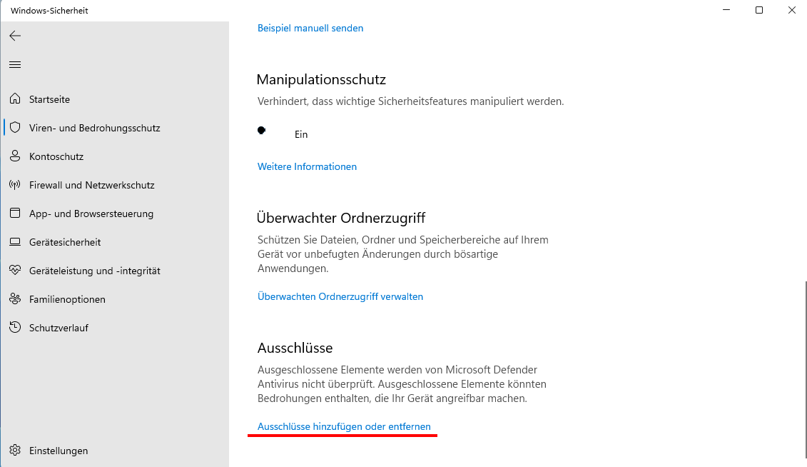

# Windows-spezifische Hinweise

## Einmalige Einrichtung der Powershell Execution Policy zur Freigabe der Ausführung von Skripten

Um die Ausführung beliebiger Powershell Skripte zu erlauben, muss in einer Administrator Powershell (Windows-Taste drücken, "Powershell" eingeben, Rechtsklick auf den Powershell Eintrag und "Als Administrator ausführen" auswählen.

`Set-ExecutionPolicy unrestricted`

ausgeführt werden. Für weitere Informationen über die Freigabe der Ausführung von Powershell Skripten siehe https://learn.microsoft.com/en-us/powershell/module/microsoft.powershell.security/set-executionpolicy

Möglicherweise muss auch die Ausführung des Skripts manuell erlaubt werden. Hierfür muss in einer Powershell der Befehl

`Unblock-File -Path .\<BASIS_PFAD>\start.ps1`

abgesetzt werden, wobei <BASIS_PFAD> den Pfad zur 'start.ps1' Datei vom Arbeitsverzeichnis der Powershell darstellt. Abhängig von den Nutzerberechtigungen kann hierfür eine Administrator Powershell notwendig sein.

## Windows-Defender Warnhinweis für start.exe ausschalten

Leider markiert der Windows Defender (und möglicherweise auch Antivirussoftware) die geruntergeladene Datei als nicht-vertrauenswürdig. Daher kann es erforderlich sein, die *start.exe* nach dem Entpacken des Archivs in die entsprechende Allowlist aufzunehmen. Der Ablauf hierfür ist nachfolgend beispielhaft für Windows 11 dargestellt:

1. Entpacken des Archivs in ein beliebiges Verzeichnis
2. Im Reiter *Viren- und Bedrohungsschutz* des Menüs *Windows-Sicherheit* auf *Einstellungen verwalten* klicken.

    

3. *Ausschüsse hinzufügen oder entfernen* auswählen.

    

4. Anschließend auf *Ausschluss hinzufügen* klicken und über den Reiter *Datei* durch den Explorer die zuvor entpackte *start.exe* auswählen. Die freigegebene Datei wird anschließend unter den Ausschlüssen gelistet.

    

5. Doppelklick auf die *start.exe*. Trotz der Ausnahme erfordert Windows eine erneute Bestätigung. Hierfür im Warnfenster auf *Weitere Informationen* und anschließend auf *Trotzdem ausführen* klicken. Dies startet das Programm.

    

    

Dieser Vorgang muss nicht wiederholt werden. Zukünftig kann die Datei durch Doppelklick wie gewohnt gestartet werden.